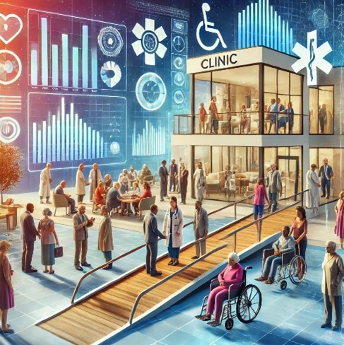

# 🛠️ My Portfolio

I am a Business Analyst, Public Health Professional, and Researcher. Passionate about delivering data-driven insights and solving complex problems. I specialize in conducting needs assessments, stakeholder engagement, and process improvement, with a proven ability to analyse system needs and provide effective, efficient solutions. My expertise spans change management, strategic planning, and aligning business goals with actionable outcomes. With a focus on innovation and collaboration, I ensure that every solution meets organizational needs while driving measurable impact. The projects I have successfully delivered are as follows: 🚀

---

## 🏗️ Projects

### 1️⃣ Optimizing Primary Healthcare Delivery for the NHS
  
I worked to address disparities in healthcare access and outcomes by leveraging data insights, engaging stakeholders, and developing innovative solutions for underserved populations. My contributions to the "Optimizing Primary Healthcare Delivery for the NHS" project focused on creating equitable, efficient, and patient-centered healthcare systems.

**Role**:  
 
1. **Analyzing Health Inequalities**:  
   - Mapped out disparities in access to primary healthcare services using population health data, workshops, focus group discussion.
   - Identified barriers and provided data-driven recommendations to bridge gaps in care for marginalized communities.

2. **Stakeholder Collaboration**:  
   - Partnered with NHS trust, ICB, Universities and community organizations, and local councils to integrate diverse perspectives into strategic planning.
   - Conducted workshops and focus groups to gather insights on healthcare challenges faced by underserved populations.
  
3. **Data-Driven Solutions:**:
   - Used data visualization tools like Power BI, and Excel to analyze service performance and identify trends in patient satisfaction and healthcare outcomes.
   - Delivered actionable reports and dashboards to inform decision-making processes.

4. **Program Development:**:
   - Helped design and pilot innovative care models, such as mobile clinics and telehealth solutions, tailored to the needs of disadvantaged communities.
   - Advocated for equitable access by developing culturally competent care pathways and resources.

5. **Policy Alignment:**:
   - Aligned project strategies with NHS England's goals to reduce health inequalities and enhance patient care.
   - Contributed to policy briefs that integrate equity-focused practices into primary care delivery.

**Key Achievements**:  
- Designed a framework to monitor and evaluate the impact of healthcare delivery models on reducing health inequalities.
- Strengthened partnerships between NHS and community stakeholders, fostering trust and improving participation in healthcare initiatives by 5%.
- Delivered resources to NHS and other political partners to enhance their understanding of social determinants of health and cultural competence

---
### 2️⃣ Addressing Pain Points in Canadian Emergency Response Benefits

I worked to improve the efficiency and equity of Canada’s Emergency Response Benefits system by identifying bottlenecks and proposing actionable solutions.

**Role**:  
- Conducted qualitative research, including interviews, focus group discussions, and data analysis to identify key challenges in the system.
- Collaborated with stakeholders to gather firsthand insights on user experience and system barriers.
- Developed project plans, timelines, and budgets to ensure smooth execution.
- Coordinated teams, managed resources, and ensured effective communication.
- Led risk management efforts, identifying challenges early and implementing mitigation strategies.  

**Key Achievements**:  
- Produced comprehensive reports on system inefficiencies based on data analysis and stakeholder interviews.
- Developed policy recommendations to improve accessibility and efficiency.
- Proposed technological solutions to streamline benefit disbursement processes.
- Identified areas for process optimization, reducing approval delays and increasing transparency.

---

### 3️⃣ Enhancing Public Health Emergency Preparedness

This project aimed to improve the preparedness of Canada’s public health systems for future health emergencies.

**Role**:  
1. **Research Leadership**:  
   - Designed and implemented a framework to assess COVID-19 preparedness.  
   - Managed project milestones and deliverables to ensure success.  

2. **Stakeholder Engagement**:  
   - Collaborated with public health agencies and organized focus groups to identify gaps in response strategies.  
   - Regularly communicated findings to stakeholders.  

3. **Data Collection and Analysis**:  
   - Developed surveys and conducted interviews with diverse groups.  
   - Presented findings in accessible reports for policymakers and the public.  
**Key Achievements**:
- Delivered actionable insights influencing provincial and national policy discussions
- Fostered relationships with key stakeholders for ongoing collaboration
- Created publicly available tools to enhance emergency preparedness strategies

---

### 4️⃣ Building Berkshire Together - New Hospital Programme

I worked to ensure equitable healthcare access by addressing disparities within underserved populations as part of the New Hospital Programme.

**Role**:  
1. Collected and analyzed data to understand the root causes of health disparities.  
2. Advocated for and developed policies promoting health equity.  
3. Led community outreach programs to educate the public about health inequalities.  
4. Measured program success through quantitative and qualitative evaluation methods.  

**Key Achievements**:  
- Produced reports highlighting disparities and their impact on healthcare outcomes
- Built partnerships with non-profits to provide supplemental healthcare services
- Implemented public health campaigns to raise awareness about the program

---

### 5️⃣ NHS Health Checks Program

I contributed to the successful rollout and evaluation of NHS Health Checks, focusing on improving accessibility and outcomes for priority populations.

**Role**:  
1. Oversaw program rollout to eligible individuals in the community.  
2. Promoted the program to underserved populations.  
3. Analyzed health data to identify trends in health risks.  
4. Supported public health campaigns to raise awareness about preventive care.  

**Key Achievements**:  
- Coordinated logistics for health checks and follow-up care.
- Improved health outcomes for high-risk individuals through targeted interventions.
- Produced reports for policymakers to enhance service delivery.

---

### 6️⃣ The E-Commercialisation Project

This project focused on transforming traditional business models into scalable digital platforms.

**Role**:  
1. Collaborated with stakeholders to gather business requirements.  
2. Analyzed market trends to identify growth opportunities.  
3. Designed digital solutions to streamline e-commerce workflows.  
4. Provided project management support to ensure timely delivery.  

**Key Achievements**:  
- Improved operational efficiency, reducing order processing times.
- Enhanced customer experience, increasing retention rates and repeat purchases.
- Identified inefficiencies and proposed solutions for digital transformation.

---

## 🎓 Education and Certifications

### 🎓 Education
- **2019**: Master of Science in International Public Health  
  University of Leeds, United Kingdom  
- **2017**: Master of Science in Food Science  
  University of Copenhagen, Denmark  
---

### 📜 Certifications
- **BCS Foundation Certificate in Business Analysis**  
- **BCS Practitioner Certificate in Business Analysis Practice**  
- **Project Management**  
---

# 👔 Work Experience

### Business Analyst | Vinci-futurist | United Kingdom (October 2023 - Present)
- Analyzed "As-Is" workflows to identify inefficiencies, leading to the design and implementation of streamlined "To-Be" processes that improved operational efficiency by 25%. 
- Recommended technology solutions to support process automation, reducing manual errors by 30%. 
- Supported change management efforts by creating training materials, user guides, and communication plans, ensuring a smooth transition for 150+ end-users. 
- Collaborated with cross-functional stakeholders to elicit and document requirements, ensuring alignment with organizational objectives and reducing project rework by 15%. 
- Facilitated workshops with business units and leadership to define pain points and develop a shared vision for future-state processes. 

---

### Community Health Inequalities Officer | Reading Borough Council | United Kingdom (December 2023 - May 2024)
- Facilitated process improvements within the Community Health Champions program by engaging community members, driving increased participation, and fostering sustainable community development.
- Demonstrated leadership and change management expertise by collaborating with key stakeholders, including NHS and Integrated Care Boards, to design and implement strategies for participatory initiatives, resulting in an impactful report addressing systemic challenges faced by marginalized communities.
- Streamlined stakeholder collaboration processes to align objectives, ensure compliance with government regulations, and lead initiatives that enhanced health outcomes and service delivery.
- Managed team performance and development, effectively line-managing junior staff to ensure alignment with project goals, resolving conflicts, and fostering a collaborative and growth-oriented team environment.
- Implemented data-driven process evaluations, ensuring compliance with data protection standards and delivering comprehensive reports on project progress, achievements, and challenges to inform stakeholders and optimize future initiatives.

---

### Research Project Manager - Data and Insights Analyst | African Women Association of Windsor | Canada (October 2022 - June 2023)
- Led and mentored research team members to conduct comprehensive needs assessments, collect and analyze data through telephone interviews, and ensure compliance with ethical and data governance standards.
- Performed in-depth data analysis and synthesis, including conducting literature reviews to identify gaps and applying critical appraisal techniques to validate research methods and findings.
- Designed and implemented data-driven methodologies, integrating qualitative and quantitative approaches to extract actionable insights and support decision-making. 
- Contributed to resource acquisition by developing grant applications and funding proposals, ensuring alignment with strategic research objectives and resource optimization. 
- Produced detailed data reports and insights, showcasing technical proficiency in presenting findings through research reports, funding proposals, and academic publications while adhering to high standards of data accuracy and rigor. 

---

### Business Relationship Officer | Compugen, Canada for Public Health Ontario | Canada (March 2021 - June 2021)
- Streamlined information-sharing processes by collaborating with the provincial health system governing board, demonstrating flexibility in adjusting timelines and ensuring the timely provision of updated data to support decision-making. 
- Optimized communication workflows to ensure the accurate and timely dissemination of vaccination information services, significantly contributing to increased vaccine uptake and improvements in patient and clinical care outcomes. 
-  Implemented screening protocols for vulnerable and at-risk populations, identifying gaps and providing data-driven public health recommendations to address project goals and improve service delivery. 
- Contributed to continuous improvement initiatives by documenting lessons learned, best practices, and recommendations for future projects to enhance readiness and responsiveness in health service delivery. 
- Implemented strategies for improved business relationship management, resulting in increased client satisfaction and retention. 

---

### Research Assistant - Data and Insights Analyst | Western University Ontario | Canada (October 2020 - March 2021)
- Designed and implemented robust evaluation frameworks, incorporating ethical considerations and overseeing data collection, analysis using advanced statistical tools, and reporting to drive evidence-based improvements in processes and outcomes.
- Assessed findings against program objectives, identifying gaps and recommending actionable solutions to ensure alignment with organizational goals and enhance process efficiency. 
- Provided critical insights and analytics through comprehensive consultations, offering data-driven recommendations that informed strategic planning and optimized workflows within the research team. 
- Collaborated with stakeholders to align objectives, ensuring seamless integration of data insights, effective resource management, and impactful decision-making to improve overall performance.
- Utilized effective business relationship management skills to facilitate communication between technical teams and non-technical stakeholders.

---

## 📚 Publications

<ul>
   <li><a href="https://www.researchgate.net/publication/373556835_The_law_against_Female_Genital_Mutilation_FGM_can_scare_people_from_performing_FGM_but_it_doesn't_change_their_attitudes_Findings_of_a_qualitative_study_on_FGM_in_Leeds_United_Kingdom">The Law Against Female Genital Mutilation (FGM)</a> 
</ul>

